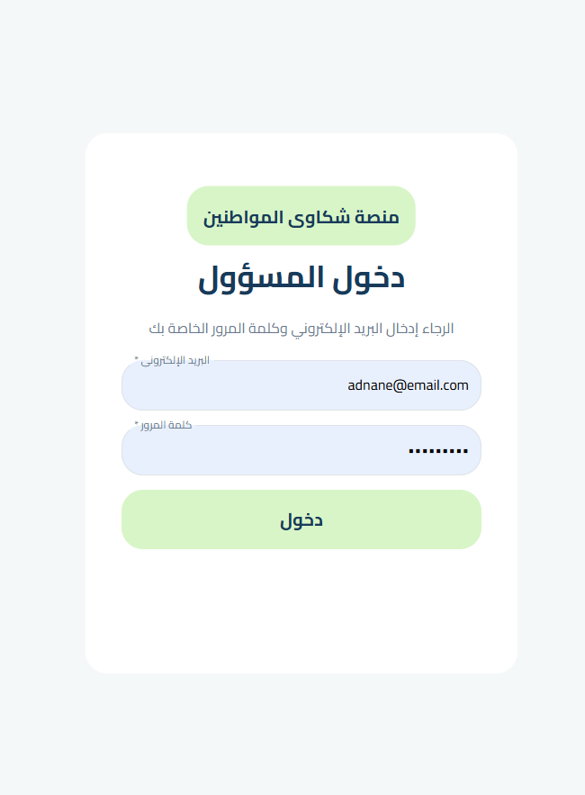
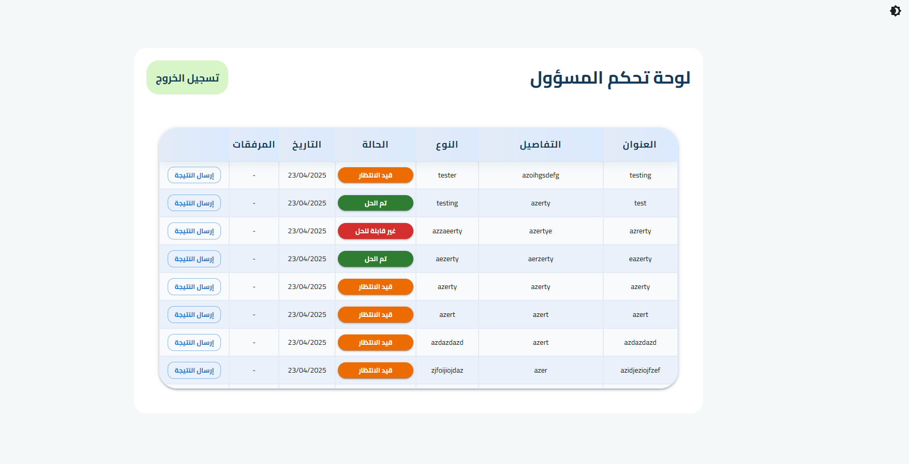
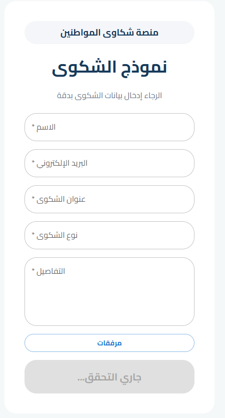

# Citizen Complaints Management - DEMO

## 🚀 Démarrage rapide (Quickstart)

1. **Cloner le dépôt**
   ```sh
   git clone <url-du-repo>
   cd citizen-js
   ```
2. **Installer Node.js** (si ce n'est pas déjà fait)
   - Télécharger la version LTS sur [nodejs.org](https://nodejs.org/fr/download/)
   - Vérifier dans un terminal :
     ```sh
     node -v
     npm -v
     ```
3. **Lancer la démo**
   ```sh
   start-demo-full.bat
   ```
   - Ce script installe toutes les dépendances, crée les fichiers nécessaires, lance le backend et le frontend, et prépare un compte admin.
   - Ouvrez [http://localhost:3000](http://localhost:3000) dans votre navigateur.

---

## 📸 Aperçu de l'application

Ajoutez ici vos captures d'écran principales :



*Accueil utilisateur*



*Tableau de bord administrateur*



*Soumission d'une réclamation*

---

## 📂 Structure du projet
- `backend/` : API Node.js/Express, base NeDB, scripts admin
- `frontend/` : Application React (citoyen + admin)
- `start-demo-full.bat` : Script d'installation et de lancement tout-en-un

Pour la documentation technique détaillée, voir les README dans `backend/` et `frontend/`.
