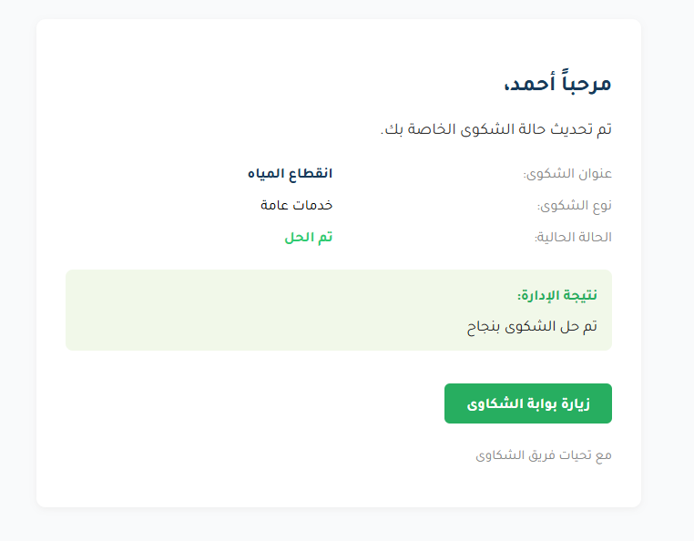

# Frontend - Gestion des réclamations citoyennes

## Installation de Node.js (Windows)

(Si ce n'est pas déjà fait, voir les instructions dans le README global.)

## Stack
- React
- Axios
- Material-UI (optionnel)

## Démarrage rapide (démo)

**Pour lancer le projet sur un nouvel ordinateur :**

1. Clonez ce dépôt (`git clone ...`).
2. Ouvrez un terminal à la racine du projet.
3. Exécutez : `start-demo-full.bat`
   - Le script installe toutes les dépendances (backend & frontend), lance les serveurs, et prépare tout automatiquement.
   - L'application sera accessible sur [http://localhost:3000](http://localhost:3000) dans votre navigateur.

---

## Démarrage manuel (avancé)

1. Naviguer dans le dossier `frontend` :
   ```sh
   cd frontend
   ```
2. Installer les dépendances :
   ```sh
   npm install
   ```
3. Lancer l'application :
   ```sh
   npm run start
   ```
4. L'app est accessible sur [http://localhost:3000](http://localhost:3000)

## Configuration de l'API
- Par défaut, les appels API pointent vers `http://localhost:5000` (backend local)
- Pour déploiement, modifiez l'URL de l'API dans le code (ex: `.env` ou directement dans les fichiers Axios) pour pointer vers l'URL la nouvelle URL du backend

## Fonctionnalités principales (avec exemples)

### 1. Formulaire de soumission de réclamation (citoyen)
- **Explication :** Permet à tout citoyen de déposer une réclamation sans compte.
- **Exemple visuel :**
  
  *Remplissez le formulaire, ajoutez une pièce jointe si besoin, puis cliquez sur "إرسال".*
- **Exemple de code (extrait de `ComplaintForm.js`) :**
  ```js
  const handleSubmit = async (e) => {
    e.preventDefault();
    setError('');
    setSuccess(false);
    try {
      const formData = new FormData();
      formData.append('name', name);
      formData.append('email', email);
      formData.append('title', title);
      formData.append('type', type);
      formData.append('details', details);
      if (file) formData.append('attachment', file);
      await axios.post('http://localhost:5000/api/complaints', formData, {
        headers: { 'Content-Type': 'multipart/form-data' }
      });
      setSuccess(true);
      setName(''); setEmail(''); setTitle(''); setType(''); setDetails(''); setFile(null);
    } catch (err) {
      setError('حدث خطأ. حاول مرة أخرى.');
    }
  };
  ```

### 2. Tableau de bord administrateur
- **Explication :** Permet à l'admin de visualiser, filtrer et traiter toutes les réclamations.
- **Exemple visuel :**
  
  *Affichage des réclamations, actions rapides, et gestion des statuts.*
- **Exemple de code (extrait de `AdminDashboard.js`) :**
  ```js
  <TableBody>
    {complaints.map((c) => (
      <TableRow key={c._id}>
        <TableCell>{c.title}</TableCell>
        <TableCell>{c.status}</TableCell>
        <TableCell>
          <Button
            variant="outlined"
            size="small"
            onClick={async () => {
              const result = c.status === 'resolved' ? 'تم حل الشكوى بنجاح' : `حالة الشكوى: ${c.status}`;
              try {
                await axios.post(`http://localhost:5000/api/complaints/${c._id}/result`, { result }, {
                  headers: { Authorization: `Bearer ${localStorage.getItem('token')}` }
                });
                setSuccessMessage('✅ تم إرسال النتيجة بنجاح إلى صاحب الشكوى');
              } catch {
                setError('حدث خطأ أثناء إرسال النتيجة');
              }
            }}
          >
            إرسال النتيجة
          </Button>
        </TableCell>
      </TableRow>
    ))}
  </TableBody>
  ```

### 3. Notification visuelle de succès
- **Explication :** Après chaque action réussie (ex : envoi du résultat), une bannière verte s'affiche sous le titre "لوحة تحكم المسؤول".
- **Exemple affiché :**
  ```
  ✅ تم إرسال النتيجة بنجاح إلى صاحب الشكوى
  ```
  *La notification disparaît automatiquement après quelques secondes.*
- **Exemple de code (extrait de `AdminDashboard.js`) :**
  ```js
  {successMessage && (
    <Stack sx={{ mb: 3, alignItems: 'center', width: '100%' }}>
      <Paper elevation={8} sx={{ px: 4, py: 2, bgcolor: '#27ae60', color: '#fff', fontWeight: 700, fontSize: 20, borderRadius: 2 }}>
        {successMessage}
      </Paper>
    </Stack>
  )}
  ```

### 4. Prévisualisation HTML des emails envoyés
- **Explication :** Chaque fois qu'une réclamation est traitée, un email HTML stylisé est envoyé au citoyen.
- **Exemple de rendu :**
  
  
  
  *Aperçu réel du contenu de l'email envoyé au citoyen (voir également `screenshots/complaint-result-preview.html`).*
- **Exemple de code (génération HTML côté backend)** :
  ```js
  const html = `
    <div style="font-family: 'Tajawal', Arial, sans-serif; background: #f9fafb; padding: 24px;">
      <div style="max-width: 600px; margin: auto; background: #fff; border-radius: 10px; box-shadow: 0 2px 8px #eee; padding: 32px;">
        <h2 style="color: #183a5a;">مرحباً ${complaint.name || ''},</h2>
        <p style="font-size: 18px; color: #333;">تم تحديث حالة الشكوى الخاصة بك.</p>
        ...
      </div>
    </div>
  `;
  ```

### 5. Téléchargement des pièces jointes
- **Explication :** L'admin peut télécharger les fichiers joints aux réclamations.
- **Exemple visuel :**
  
  *Cliquez sur "عرض" pour ouvrir la pièce jointe.*
- **Exemple de code (extrait de `AdminDashboard.js`) :**
  ```js
  <TableCell>
    {c.attachment ? (
      <Button
        href={`http://localhost:5000/uploads/${c.attachment}`}
        target="_blank"
        rel="noopener noreferrer"
        variant="outlined"
        size="small"
      >
        عرض
      </Button>
    ) : '-'}
  </TableCell>
  ```

### 6. Authentification sécurisée pour l'admin
- **Explication :** Accès réservé à l'admin via une page de connexion sécurisée (JWT).
- **Exemple visuel :**
  
  *Entrez vos identifiants pour accéder au dashboard.*
- **Exemple de code (extrait de `Login.js`) :**
  ```js
  const handleSubmit = async (e) => {
    e.preventDefault();
    try {
      const res = await axios.post('http://localhost:5000/api/user/login', { email, password });
      localStorage.setItem('token', res.data.token);
      navigate('/admin');
    } catch (err) {
      setError('خطأ في تسجيل الدخول');
    }
  };
  ```

### 7. Interface responsive et moderne
- **Explication :** L'application s'adapte à tous les écrans grâce à Material-UI et des styles personnalisés.
- **Exemple :**
  *Testez l'application sur mobile, tablette, ou desktop pour voir l'adaptation automatique.*

---

### Parcours utilisateur
- **Dépôt de réclamation sans compte**
  - Remplissez le formulaire et soumettez. Pas besoin de créer un compte !
- **Suivi du traitement via email**
  - Vous recevrez un email à chaque mise à jour de votre réclamation.

### Parcours admin
- **Connexion sécurisée**
  - Accès au dashboard via la page de connexion.
- **Gestion complète des réclamations**
  - Visualisez, filtrez, téléchargez les pièces jointes, et envoyez le résultat au citoyen.
- **Envoi de résultats avec notification**
  - Après avoir cliqué sur "إرسال النتيجة", le citoyen reçoit un email HTML et l'admin voit une notification de succès.

### Notifications & Email
- **Notification verte**
  - Exemple : `✅ تم إرسال النتيجة بنجاح إلى صاحب الشكوى`
- **Email HTML**
  - Voir le fichier `screenshots/complaint-result-preview.html` pour un exemple réel.

### Structure des composants principaux
- `AdminDashboard.js` : gestion et affichage des réclamations, notifications
- `ComplaintForm.js` : formulaire citoyen
- `Login.js` : authentification admin

- Soumission de réclamation (citoyen)
- Connexion admin
- Gestion et suivi des réclamations (admin)
- Téléchargement des pièces jointes (admin)

## À venir
- Notifications email
- Statistiques et rapports

## Description
واجهة ويب تتيح للمواطنين إرسال الشكاوى دون تسجيل دخول، وتوفر لوحة تحكم خاصة للمسؤول (الإدارة) لتتبع ومعالجة الشكاوى.

## Structure
- صفحة إرسال الشكوى (مفتوحة للجميع)
- صفحة دخول المسؤول
- لوحة تحكم المسؤول (إدارة الشكاوى)

## Prerequisites
- Node.js
- npm

## 📧 Configuration email (notifications citoyen)
Pour envoyer des emails, configurez le fichier `.env` du backend (voir README backend pour Gmail App Password).

## Démarrage
1. تثبيت الحزم: `npm install`
2. تشغيل التطبيق: `npm start`

- L'interface utilisateur est responsive, moderne (Material-UI), et prend en charge l'arabe (RTL).

## 🛠️ Fonctionnalités principales
- Soumission de réclamation sans compte
- Tableau de bord admin sécurisé (connexion JWT)
- Téléchargement de pièces jointes
- Notification visuelle de succès (Snackbar)
- Envoi automatique d'email HTML stylisé au citoyen (voir README backend pour config)
- Nettoyage automatique des doublons
- Interface responsive (Material-UI), support complet de l'arabe (RTL)

## ❓ Dépannage & FAQ
- **Erreur email :** Vérifiez la configuration dans le backend et l'utilisation d'un App Password Gmail
- **Notification non affichée :** Vérifiez la console pour les erreurs réseau/API
- **Problème d'accès admin :** Voir script de création admin dans le backend

Pour la configuration avancée, voir les README du backend et du projet racine.
